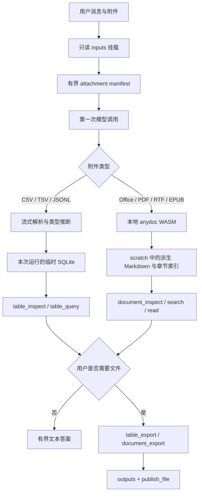

# Pi Agent 的 Agentic Attachment 管线

## 核心不变量

1. 附件字节数不决定首轮模型上下文大小。用户提交附件后，模型只收到有界 manifest，不自动收到文件全文。
2. 原始附件只读挂载在 `inputs/`，原生 `file://`、`content://` 和应用沙盒真实路径不会进入模型上下文或工具结果。
3. 大表与普通文档走不同的数据面：CSV/TSV/JSONL 进入流式 SQLite；Office/PDF/RTF/EPUB/OpenDocument 由 anydoc 本地归一化。
4. 所有模型可见结果同时受行数、单元格长度和 UTF-8 字节数限制。
5. 派生数据默认留在本次运行的 `scratch/`；只有 `outputs/` 下的文件才可以进入消息流供用户打开或分享。

## 执行流程

历史消息采用相同协议。历史附件路径为 `inputs/history/<message-id>/...`；历史图片不会在每一轮重新编码进上下文。

## 模型可见 manifest

Manifest 只包含附件 ID、清洗后的文件名、逻辑路径、字节数、类型和建议工具。单条 manifest 最多列出 100 个附件，并有 64 KiB 硬上限。文件名按 NFC 规范化、去控制字符并消除同名冲突；路径命名与 `AgentInputBackend` 使用同一实现，避免模型看到的路径和真实挂载路径不一致。

若所选模型不能调用函数工具，manifest 会明确标记 `unavailable_without_function_tools`，模型不得声称已经检查文件。

## 表格数据面

`table_inspect`、`table_query`、`table_export` 支持 CSV、TSV、JSONL 和 NDJSON。

- 文件通过 Expo `FileHandle.readBytes()` 以 64 KiB 分块解码，不调用 `File.text()` 读取整文件。
- CSV 状态机支持 UTF-8 BOM、CRLF、引号转义和跨块多行字段；分隔符可自动识别或显式指定。
- 第一次扫描得到精确行数、列数、可空性和保守类型；第二次扫描在事务内写入运行级 SQLite。
- 数字列只有在不会丢失 JS 安全整数精度时才转为数值；带前导零的编号保留为文本。
- JSONL 保留原始 JSON，并提供 `_row_number` 与 `json_valid`；查询使用 SQLite JSON 函数。
- SQL 只接受单条 `SELECT` 或非递归 `WITH ... SELECT`。写操作、PRAGMA、ATTACH、事务、扩展加载、递归 CTE、JOIN 和高风险大对象函数会在执行前拒绝；SQLite 连接在导入后开启 `query_only`。
- 查询默认最多返回 100 行，硬上限 500 行与 64 KiB；单元格最多返回 4096 字符。
- 导出最多 100,000 行、16 MiB，并且目标必须在 `outputs/`。
- 源文件最大 256 MiB、100 万行、1000 列；导入和导出有 60 秒处理上限，并在 Agent 运行结束时协作取消。

## anydoc 文档数据面

依赖固定为官方 `@firecrawl/anydoc-wasm@0.1.7`。构建脚本检查版本并把 wasm-bindgen glue 转换成无模块、无网络加载的沙箱脚本；版本或 glue 形态变化时构建直接失败，要求人工复核。

WASM 在一个按需创建、不可见的本地 WebView 内运行：

- WebView 有禁止网络、文件访问和存储的 CSP/配置；文档内容只作为字节传给 anydoc，不作为 HTML 或 JavaScript 执行。
- WASM 和文档都用分块消息传输，避免平台消息桥的单消息大小限制。
- 第一次处理文档时才加载 6.49 MiB WASM，应用启动时不创建解析运行时。
- 输入最大 24 MiB，派生 Markdown 最大 12 MiB，转换超时 90 秒。
- PDF 仅在 anydoc 运行时本身不可用时回退到现有 PDFKit/PDFBox 提取器；`encrypted`、`resourceLimit` 等 anydoc 安全错误不会被绕过。
- `document_inspect` 只返回元数据和最多 100 个章节；`document_search` 最多 50 条命中；`document_read` 最多 400 行与 50 KiB。
- 完整 Markdown 只写入 `scratch/attachments/`。用户明确要求转换文件时，`document_export` 才会复制到 `outputs/`。

CSV 不使用 anydoc。anydoc 的 CSV 转 Markdown 会放大上下文，而且其解析模型不适合大表聚合；结构化表格数据面因此保持独立。

## 上下文与资源预算

| 边界                     | 上限                                |
| ------------------------ | ----------------------------------- |
| 当前用户文本             | 256 KiB                             |
| 历史 Agent 文本          | 512 KiB，按完整对话轮次从旧到新淘汰 |
| 单条历史工具摘要         | 24 KiB                              |
| 附件 manifest            | 100 个附件、64 KiB                  |
| 当前图片输入             | 10 张、合计 20 MiB                  |
| `read` / `document_read` | 50 KiB                              |
| `table_query`            | 500 行、64 KiB                      |
| anydoc 输入 / 派生文本   | 24 MiB / 12 MiB                     |

这些是未知或自定义模型的硬安全上限，不替代 provider 自己的 token 计数。大文本应该作为附件提交，由 Agent 增量检查。

## 缓存与生命周期

- 原始附件由应用文件服务持有，运行时只建立虚拟只读引用，不复制大文件。
- 表格 SQLite 位于 `Paths.cache/AgentRuntime/runs/<run-id>/tables/`。
- anydoc 派生 Markdown 位于同一运行的 `scratch/attachments/`。
- 成功运行在发布 `outputs/` 后立即关闭 SQLite 并删除整个运行缓存。
- 失败或中止运行关闭句柄后保留 24 小时，便于诊断；现有 Agent 运行清理器到期删除。
- Topic 删除沿用 Agent runtime 的统一清理流程；没有新增永久数据库表或迁移。

## 验证

- 单元测试覆盖 manifest 与真实挂载路径一致性、上下文预算、跨块 CSV、真实 SQLite 查询/导出、SQL 拒绝策略、anydoc 桥分块、文档索引/读取和 PDF 降级策略。
- `scripts/test-anydoc-web-runtime.mjs` 会初始化实际发布的 WASM 并转换 RTF，避免只测试 mock。
- Android 与 iOS 的 Expo 生产导出都必须显示 `anydoc_wasm_bg.wasm` 已作为应用资产打包。
